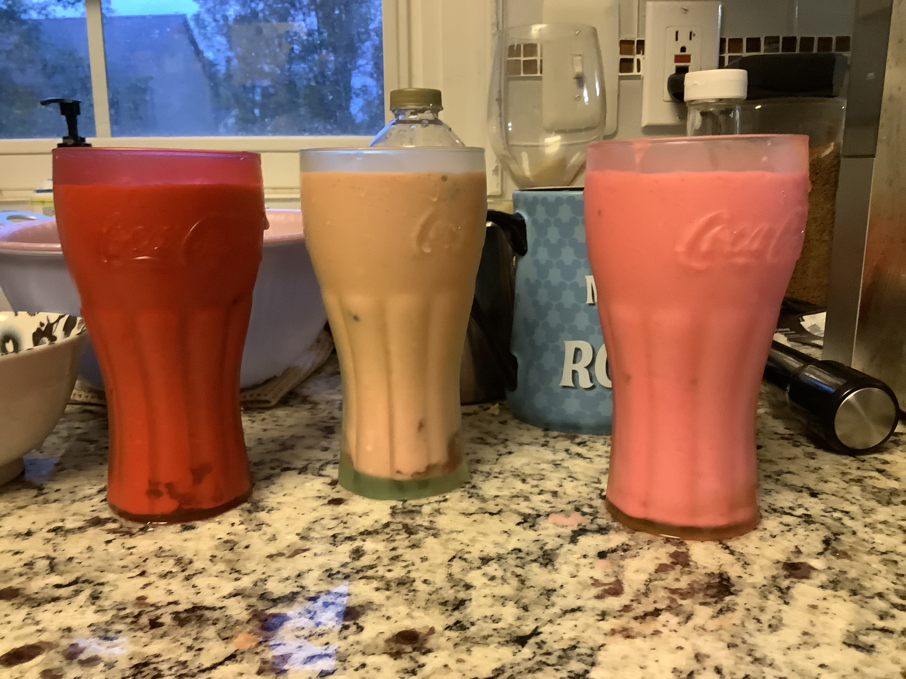

# How to make a strawberry smoothie with berries



<p>1. Put most of the strawberries in the blender. </p>


<p><b>WARNING:</b> I said "most of the strawberries." Not "all or the strawberries."</p>

<p>2. Cut the rest of the strawberries into cubes.</p>


<p>3. Pour the milk.</p>


<p>4. Add sugar.</p>
<p>5. Blend.</p>


<p>6. Add strawberries and rasberries.</p>
<p>7. Serve.</p>




# Source:

```markdown
<!--
Add https://brunozhon.github.io/news/recipes/how-to-make-a-strawberry-smoothie-with-berries/ to the front of each image URL.
-->
# How to make a strawberry smoothie with berries

1. Put most of the strawberries in the blender. 


<b>WARNING:</b> I said "most of the strawberries." Not "all or the strawberries."

2. Cut the rest of the strawberries into cubes.


3. Pour the milk.


4. Add sugar.
5. Blend.


6. Add strawberries and rasberries.
7. Serve.


<!--
Copy this and paste it in a file in your coumputer called *.md. ".md" stands for markdown. You can also use ".markdown."
-->
```
